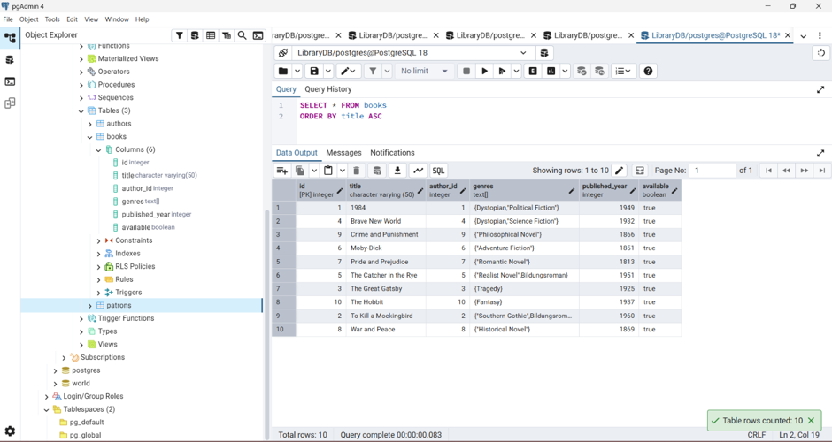
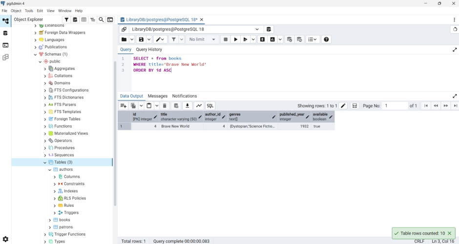
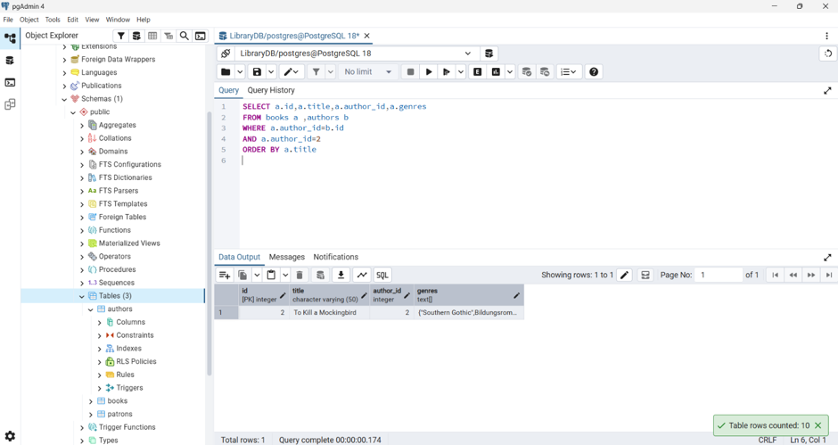
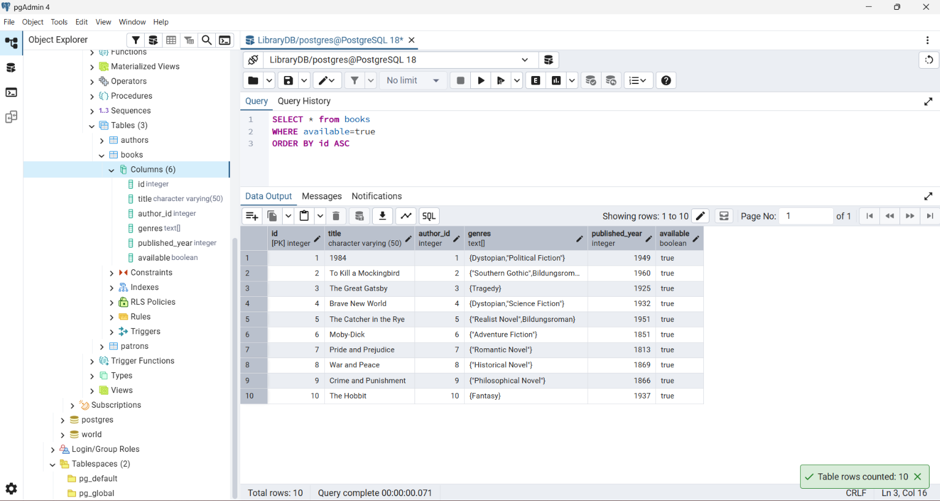
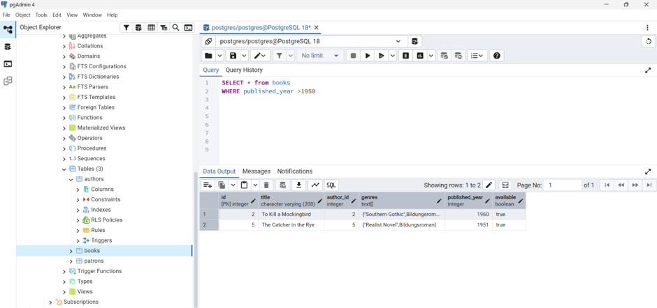
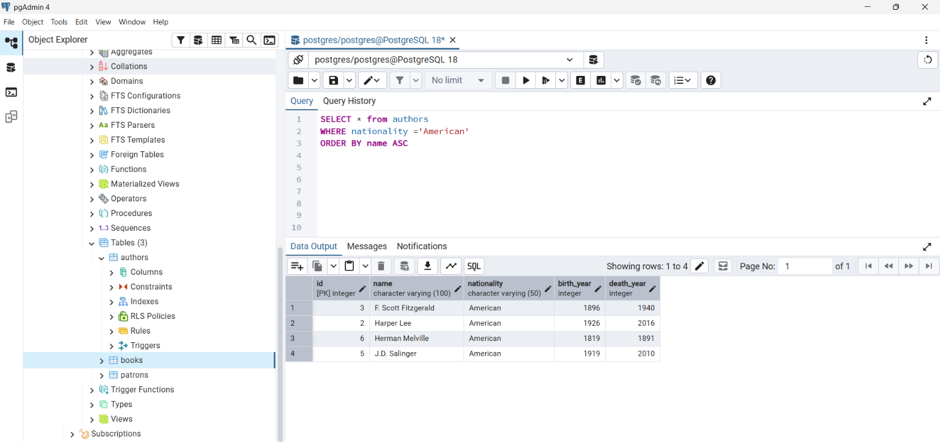
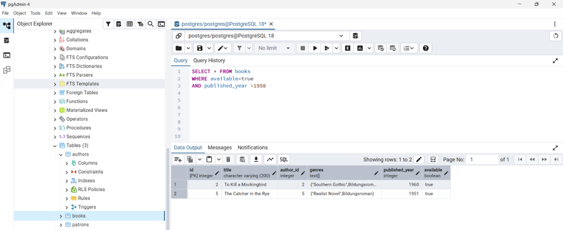

### Library Management System 

-The system manages books, authors, and patrons. 

Users can add, view, update, and delete records using PostgreSQL.

### Core Features

- Add a book

- View all books

- View a single book by title or ID

- View books by a specific author

- Update book availability (borrow/return)

- Update patron borrowed books

- Delete a book

- Delete an author

- Run advanced queries (filtering, searching, bulk updates)

## Tech Stack

-Database:PostgreSQL

-Tools:pgAdmin,psql

-Language:SQL

### PROJECT SETUP

## Creating database 

CREATE DATABASE LibraryDB 

## Creating Books table

CREATE TABLE books(

id SERIAL PRIMARY KEY,

title VARCHAR(50),

author_id INTEGER REFERENCE authors(id)

genres TEXT[],

published_year INTEGER,

available BOOLEAN

)

## Creating authors table

CREATE TABLE patrons(

id SERIAL PRIMARY KEY,

name VARCHAR(50),

email VARCHAR(50),

borrowed_books INTEGER[]

)

## Creating patrons table

CREATE TABLE patrons(

id SERIAL PRIMARY KEY,

name VARCHAR(50),

email VARCHAR(50),

borrowed_books INTEGER[]

)

###  Inserting data 

## Inserting sample data for books table 

INSERT INTO books (id, title, author_id, genres, published_year, available) VALUES

(1, '1984', 1, ARRAY['Dystopian', 'Political Fiction'], 1949, TRUE),

(2, 'To Kill a Mockingbird', 2, ARRAY['Southern Gothic', 'Bildungsroman'], 1960, TRUE),

(3, 'The Great Gatsby', 3, ARRAY['Tragedy'], 1925, TRUE),

(4, 'Brave New World', 4, ARRAY['Dystopian', 'Science Fiction'], 1932, TRUE),

(5, 'The Catcher in the Rye', 5, ARRAY['Realist Novel', 'Bildungsroman'], 1951, TRUE),

(6, 'Moby-Dick', 6, ARRAY['Adventure Fiction'], 1851, TRUE),

(7, 'Pride and Prejudice', 7, ARRAY['Romantic Novel'], 1813, TRUE),

(8, 'War and Peace', 8, ARRAY['Historical Novel'], 1869, TRUE),

(9, 'Crime and Punishment', 9, ARRAY['Philosophical Novel'], 1866, TRUE),

(10, 'The Hobbit', 10, ARRAY['Fantasy'], 1937, TRUE);

## Inserting sample data for authors  table 

INSERT INTO authors (id, name, nationality, birth_year, death_year) VALUES

(1, 'George Orwell', 'British', 1903, 1950),

(2, 'Harper Lee', 'American', 1926, 2016),

(3, 'F. Scott Fitzgerald', 'American', 1896, 1940),

(4, 'Aldous Huxley', 'British', 1894, 1963),

(5, 'J.D. Salinger', 'American', 1919, 2010),

(6, 'Herman Melville', 'American', 1819, 1891),

(7, 'Jane Austen', 'British', 1775, 1817),

(8, 'Leo Tolstoy', 'Russian', 1828, 1910),

(9, 'Fyodor Dostoevsky', 'Russian', 1821, 1881),

(10, 'J.R.R. Tolkien', 'British', 1892, 1973);

## Inserting sample data for patrons table 

INSERT INTO patrons (id, name, email, borrowed_books) VALUES

(1, 'Alice Johnson', 'alice@example.com', ARRAY[]::INT[]),

(2, 'Bob Smith', 'bob@example.com', ARRAY[1, 2]),

(3, 'Carol White', 'carol@example.com', ARRAY[]::INT[]),

(4, 'David Brown', 'david@example.com', ARRAY[3]),

(5, 'Eve Davis', 'eve@example.com', ARRAY[]::INT[]),

(6, 'Frank Moore', 'frank@example.com', ARRAY[4, 5]),

(7, 'Grace Miller', 'grace@example.com', ARRAY[]::INT[]),

(8, 'Hank Wilson', 'hank@example.com', ARRAY[6]),

(9, 'Ivy Taylor', 'ivy@example.com', ARRAY[]::INT[]),

(10, 'Jack Anderson', 'jack@example.com', ARRAY[7, 8]);

### Read Operations -Queries

## Getting all books

## Command:

SELECT * FROM books

ORDER BY title ASC

## Get a book by title 

## Command:

SELECT * from books

WHERE title='Brave New World'

ORDER BY id ASC

## GET books by specific author 

## Command 

SELECT a.id,a.title,a.author_id,a.genres

FROM books a ,authors b

WHERE a.author_id=b.id

AND a.author_id=2

ORDER BY a.title

## GET all available books

## Command:

SELECT * FROM books

WHERE available=true

ORDER BY title ASC

### Update Operations 

## Mark a book as borrowed 

## Command :

UPDATE books

SET available=false

WHERE id=7

## Add genre to an existing book 

## Command :

UPDATE books 

SET genres=genres || ARRAY['Friction']

WHERE id=1

## Add a borrowed book to patrons 

## Command :

UPDATE patrons

SET  borrowed_books=borrowed_books || ARRAY[1]

WHERE id=1

### Delete Operations 

## Delete a book by title

## Command:

DELETE from books

WHERE title ='1984'

## Delete an author by ID 

## Command:

DELETE from authors 

WHERE id=1

### Advanced Queries 

## Finding books published after 1950 

## Command:

SELECT * from books

WHERE published_year >1950

## Finding all Americans authors

## Command:

SELECT * from authors

WHERE nationality ='American'

ORDER BY name ASC

## Setting all books as available

## Command:

UPDATE books 

SET available=true

## Finding all books that are available and published after 1950

## Command:

SELECT * FROM books

WHERE available=true

AND published_year >1950

## Finding authors whose names contain "George"

## Command:

SELECT * FROM authors

WHERE name LIKE '%George%'

ORDER BY name ASC

## Incrementing the published year `1869` by 1 

## Command

UPDATE books

SET published_year =published_year+1

WHERE published_year=1869

### Running Queries in pgAdmin

-Open pgAdmin and connect to your server with the correct password

 -Expand your database 

 -Right click the database and select Query tool 

 -Write  SQL commands 

 -Click the run button (triangle shape button)

-Results will appear in the Data output below 

### Running Queries in psql

## Open powershell

## Navigate to the PostgreSQL bin folder

e.g cd `C:\Program Files\PostgreSQL\18\bin`

## Connect to Postgres:

`.\psql -U postgres`

## Switch into your database

`\c LibraryDB`

## Type your SQL commands directly 

e.g 

SELECT * FROM authors;

